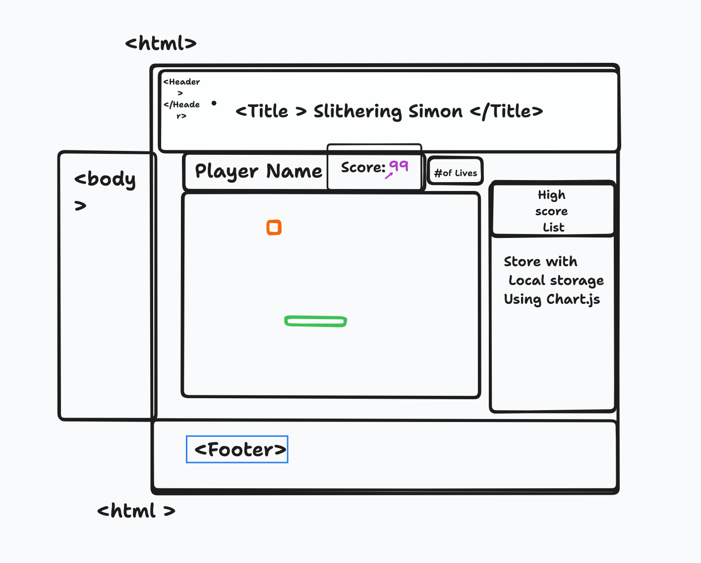

# Course 201 Team One: The East Code

## Project Name: Classic Snake Game

Our project aims to create a Classic Snake game using JavaScript. The game will feature a snake that grows in length as it consumes food and a simple grid-based playing area. Players will control the snake's direction, and the game's objective will be to eat as much food as possible without colliding with the walls or the snake's own tail. The game will keep score of player losses and wins.

### Author: Latherio Kidd, Ekow Yawson, Stephanie G. Johnson, Felix Taveras, David Grier

### Links and Resources

#### A. Wireframes & Software Requirements

1. [User Stories](https://docs.google.com/document/d/1WjaIpBPHJSYX6xikpz2NYYcdhOgO1v_t4116xb7SXDI/edit?usp=sharing)

2. [Project Management Tasks List](https://app.asana.com/0/1205909841408792/1205909841408792)

3. [Wireframe](Wireframe&Reqs/kiddsidea.tldr)

    

4. [Database Schema](Wireframe&Reqs/databaseschema.md)

5. [Domain Model](Wireframe&Reqs/domain-model.md)

#### B. Submission Link

1. [Submission Link](https://theeastcode.github.io/ClassicSnakeGame/)

2. [Repo Link](https://github.com/TheEastCode/ClassicSnakeGame.git)

### Lighthouse Accessibility Report Score

* Provide a screenshot of your score after running a Lighthouse Accessibility report.

### Reflections and Comments

* Consider including the answers to your daily journal and submission questions here
* This is also a good place to reflect on the tools and resources used and learned
