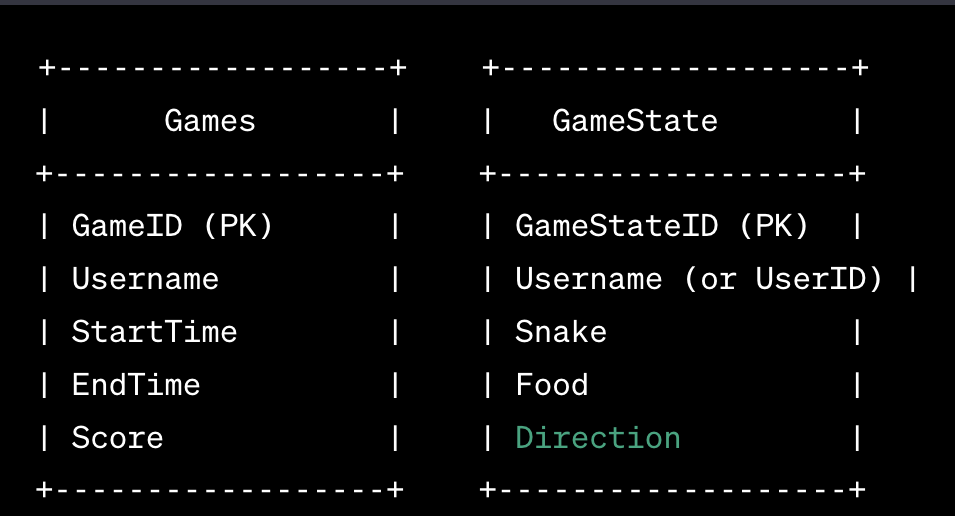

# Database Schema

## Games Table

- **GameID** (Primary Key)
- **Username** (or UserID)
- **StartTime**
- **EndTime**
- **Score**

## GameState Table (Local Storage Equivalent)

- **GameStateID** (Primary Key)
- **Username** (or UserID)
- **Snake** (JSON string representing the snake state)
- **Food** (JSON string representing the food state)
- **Direction**

## Diagram

